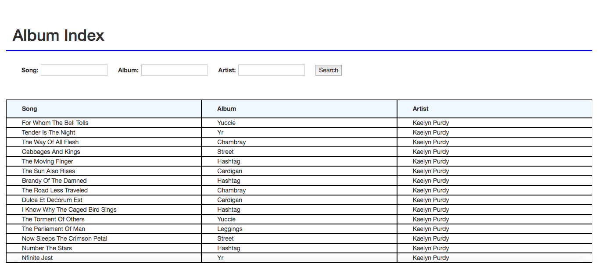

# Album Index

Rails application with a search interface. Customer service can search song database by any combination of song title, album title, and artist name.

* 500 songs, 100 albums, 10 artists
* Returns a list of songs with album and artist info
* The search uses Ajax
* Mobile responsive user interface
* Test suite uses RSpec

To run on local machine, clone repo and:


```
$ bundle install
$ rake db:create db:migrate db:seed
$ rails server
```

To test, clone repo and:
```
$ bundle install
$ rake db:create db:migrate
$ rspec
```

Production application is hosted on Heroku at:

`https://album-index-ml.herokuapp.com/`

## Album Index Search Interface:

